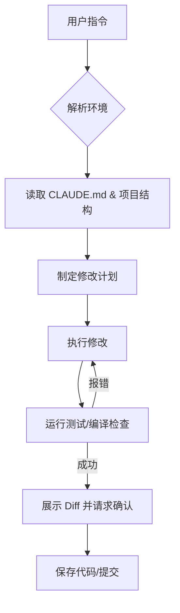

在 Claude Code 的实际运行中，它的工作流程（Workflow）并不是简单的“问与答”，而是一套基于 **Agentic Loop（智能体循环）** 的闭环逻辑。

我们可以将其拆解为从“你输入指令”到“代码落地”的五个关键阶段：

---

### 1. 意图解析与环境感知 (Inquiry & Context)

当你输入一个需求（比如“修复登录界面的样式 Bug”）时，Claude Code 不会盲目猜测：

- **读取 `CLAUDE.md**`：它首先会查看你项目根目录下的规范文件，确认项目的技术栈、代码风格和测试命令。
- **扫描文件树**：它会运行类似 `ls -R` 的内部工具，快速构建你项目的结构图。
- **上下文检索**：如果是复杂问题，它会利用嵌入向量或搜索工具寻找相关的代码片段。

### 2. 任务规划 (Planning)

Claude 会在后台生成一个**思维链（Chain of Thought）**：

- **分解步骤**：例如：1. 找到 CSS 文件 -> 2. 运行开发服务器 -> 3. 修改代码 -> 4. 验证效果。
- **决策工具**：它会决定是直接修改，还是先运行一个 `grep` 命令搜索关键词。

### 3. 执行循环：读、写、跑 (The Loop)

这是 Claude Code 最核心的**“自主”**阶段。它会交替使用以下工具：

- **Read (读)**：读取相关文件内容。
- **Edit (写)**：使用特定的 `sed` 或 `patch` 工具精确修改代码行，而不是重写整个文件（节省 Token 且更安全）。
- **Run (跑)**：**这是关键！** 它会尝试运行编译或测试命令（如 `npm test`）。
- _如果报错_：它会读取报错信息，自我修正，重新执行修改。
- _如果成功_：进入下一步。

### 4. 验证与总结 (Validation)

在认为任务完成后，它会：

- **自检**：对比修改前后的差异。
- **运行测试**：确保没有引入破坏性改动（Regression）。
- **报告**：向你解释它做了哪些改动，并列出受影响的文件。

### 5. 交互式确认 (Human-in-the-loop)

最后，它会停下来征求你的意见：

- 你可以输入 `y` 接受改动。
- 或者直接继续对话：“测试没过，再改改。”

---

### 流程总结图

---

### 💡 一个隐藏的底层细节

Claude Code 采用的是 **"Agent-on-the-side"** 模式。这意味着它并不是直接接管你的编辑器，而是作为一个**并行的终端助手**。

> **提示：** 它的工作流质量高度依赖于你的 `CLAUDE.md`。如果你的 `CLAUDE.md` 里没有写清楚测试命令，它的“执行循环”就会失去验证环节，导致生成的代码可能无法运行。
