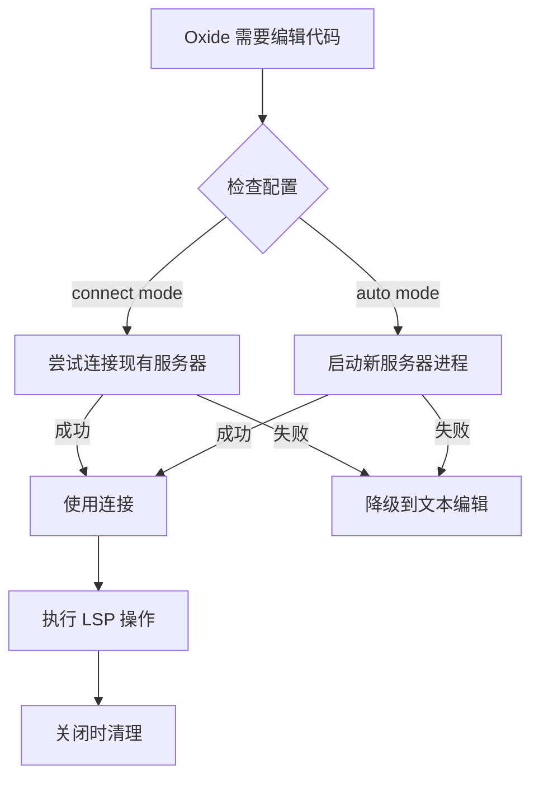

## Context

Oxide 当前是一个基于文本编辑的 AI 编程助手，使用 unified diff 格式修改代码。虽然这种方式简单可靠，但存在明显限制：

1. **缺乏语义理解** - 无法区分函数定义、函数调用、注释等语法元素
2. **多语言支持弱** - 对每种语言都需要编写特定的解析逻辑
3. **无错误反馈** - 无法知道修改是否引入了语法错误或类型错误
4. **重构困难** - 无法执行跨文件重命名、提取函数等操作

LSP（Language Server Protocol）是微软开发的标准化协议，已有 20+ 语言实现了语言服务器。通过集成 LSP 客户端，Oxide 可以：
- 复用现有的成熟语言服务器（rust-analyzer, pyright, gopls 等）
- 获得语义级别的代码理解能力
- 提供跨语言的一致体验

### Stakeholders
- **终端用户** - 希望获得更智能的代码编辑体验
- **开发者** - 需要维护和扩展 LSP 集成
- **语言服务器提供者** - 依赖外部服务的可用性

## Goals / Non-Goals

### Goals
- ✅ 实现符合 LSP 规范的客户端
- ✅ 支持至少 3 种主流语言（Rust, TypeScript, Python）
- ✅ 提供语义级别的代码编辑能力
- ✅ 保持与现有 `edit_file` 工具的兼容性
- ✅ 优雅的错误处理和降级机制

### Non-Goals
- ❌ 实现语言服务器（只做客户端）
- ❌ 替代现有 IDE 功能（专注 AI 辅助场景）
- ❌ 支持所有 LSP 特性（优先实现核心功能）
- ❌ 实时协作编辑（单用户场景）
- ❌ 自定义 LSP 扩展协议（只使用标准协议）

## Decisions

### Decision 1: LSP 客户端库选择

**选择**: `async-lsp` (v0.6) + `lsp-types` (v0.95)

**理由**:
- `async-lsp` 是现代化的异步 LSP 客户端，与 Tokio 运行时完美集成
- `lsp-types` 提供 LSP 协议的 Rust 类型定义，保持与规范同步
- 两者都是社区活跃维护的项目，有良好的文档和示例

**替代方案**:
1. **tower-lsp**
   - 优点：更成熟，功能完整
   - 缺点：更复杂，主要用于服务端实现
   - 结论：过度设计，不适合客户端场景

2. **lsp-async-client**
   - 优点：轻量级
   - 缺点：维护不活跃，功能有限
   - 结论：不够成熟

### Decision 2: 通信机制

**选择**: stdio（标准输入输出）为主，TCP 为辅

**理由**:
- stdio 是 LSP 客户端-服务器通信的标准方式
- 所有主流语言服务器都支持 stdio
- 更简单，无需端口管理
- TCP 作为可选项，支持连接远程或已运行的服务器

**实现策略**:
```rust
pub enum Transport {
    Stdio(ChildStdin, ChildStdout),
    Tcp(TcpStream),
}
```

### Decision 3: 服务器生命周期管理

**选择**: 混合模式 - 自动启动 + 连接现有实例

**架构**:


**配置示例**:
```toml
[lsp.rust]
command = "rust-analyzer"
mode = "auto"  # or "connect"

[lsp.typescript]
command = "typescript-language-server"
args = ["--stdio"]
mode = "auto"
```

### Decision 4: 错误处理策略

**选择**: 优雅降级 + 详细日志

**策略**:
1. **LSP 服务器未安装** → 降级到 `edit_file`，提示安装
2. **服务器启动失败** → 降级到 `edit_file`，记录错误
3. **请求超时** → 重试 1 次，失败后降级
4. **协议错误** → 记录详细日志，降级到文本编辑
5. **服务器崩溃** → 清理进程，降级到文本编辑

**实现示例**:
```rust
pub async fn edit_with_lsp_fallback(
    &self,
    args: EditArgs
) -> Result<EditOutput> {
    match self.lsp_edit(args.clone()).await {
        Ok(result) => Ok(result),
        Err(LspError::ServerNotRunning) => {
            log::warn!("LSP server not available, falling back to text edit");
            self.text_edit(args).await
        }
        Err(e) => {
            log::error!("LSP edit failed: {}", e);
            self.text_edit(args).await
        }
    }
}
```

### Decision 5: 工作区检测机制

**选择**: 基于项目文件的自动检测

**检测规则**:
```rust
pub struct ProjectType {
    pub language: String,
    pub server_command: String,
    pub server_args: Vec<String>,
}

pub fn detect_project_type(path: &Path) -> Option<ProjectType> {
    if path.join("Cargo.toml").exists() {
        Some(ProjectType {
            language: "rust".to_string(),
            server_command: "rust-analyzer".to_string(),
            server_args: vec![],
        })
    } else if path.join("package.json").exists() {
        // 检测 TypeScript
        Some(ProjectType {
            language: "typescript".to_string(),
            server_command: "typescript-language-server".to_string(),
            server_args: vec!["--stdio"],
        })
    }
    // ... 其他语言
}
```

**优先级**: 项目配置 > 全局配置 > 默认检测

## Architecture

### 模块结构

```
src/lsp/
├── mod.rs              # 模块导出
├── error.rs            # 错误类型定义
├── client.rs           # LspClient 核心实现
├── manager.rs          # LspServerManager 服务器管理
├── workspace.rs        # 工作区检测
├── config.rs           # 配置加载
└── transport.rs        # 通信层抽象（stdio/TCP）

src/tools/
├── lsp_edit.rs         # 语义编辑工具
├── lsp_diagnostic.rs   # 诊断工具
├── lsp_symbol.rs       # 符号查询工具
├── lsp_rename.rs       # 重命名工具
└── lsp_format.rs       # 格式化工具
```

### 核心类型设计

```rust
// src/lsp/client.rs
pub struct LspClient {
    transport: Transport,
    client: LspClientInner,
    capabilities: ServerCapabilities,
    workspace_path: PathBuf,
}

impl LspClient {
    pub async fn new(config: &LspConfig) -> Result<Self>;
    pub async fn initialize(&mut self) -> Result<InitializeResult>;
    pub async fn edit(&mut self, uri: Url, edits: Vec<TextEdit>) -> Result<()>;
    pub async fn diagnostic(&mut self, uri: Url) -> Result<Vec<Diagnostic>>;
    pub async fn shutdown(&mut self) -> Result<()>;
}

// src/lsp/manager.rs
pub struct LspServerManager {
    servers: HashMap<Language, LspClient>,
    config: LspConfig,
}

impl LspServerManager {
    pub async fn get_or_start(&mut self, lang: Language) -> Result<&mut LspClient>;
    pub async fn stop_all(&mut self) -> Result<()>;
    pub fn is_running(&self, lang: Language) -> bool;
}
```

### 数据流

```
用户输入 → AI 解析 → 工具调用
                          ↓
                    LspServerManager
                          ↓
              ┌───────────┴───────────┐
              ↓                       ↓
        LspClient (Rust)        LspClient (TS)
              ↓                       ↓
        rust-analyzer      typescript-language-server
              ↓                       ↓
          返回结果 ←─────────────────┘
              ↓
          AI 整合结果
              ↓
          输出给用户
```

## Risks / Trade-offs

### Risk 1: 语言服务器可用性

**风险**: 用户可能未安装语言服务器

**影响**: 中等 - 可以降级到文本编辑

**缓解措施**:
1. 提供清晰的安装提示
2. 检测服务器是否可用
3. 优雅降级到 `edit_file`
4. 文档中说明依赖关系

### Risk 2: 性能开销

**风险**: 启动服务器和通信会增加延迟

**影响**: 低 - 大多数操作 < 100ms

**缓解措施**:
1. 实现服务器进程复用（长连接）
2. 请求并发处理
3. 超时机制（默认 5 秒）
4. 缓存常用查询结果

### Risk 3: 协议版本兼容

**风险**: 不同语言服务器可能使用不同 LSP 版本

**影响**: 中等 - 某些特性可能不可用

**缓解措施**:
1. 使用 `lsp-types` 管理版本
2. 实现能力协商（capabilities negotiation）
3. 对不支持的功能返回错误
4. 文档中标记已知兼容性

### Trade-off 1: 功能完整性 vs 复杂度

**选择**: 优先实现核心功能，后续迭代高级特性

**理由**:
- MVP 只需要 `lsp_edit` 和 `lsp_diagnostic`
- 符号查询、重命名等可以后续添加
- 降低初期开发和维护成本

### Trade-off 2: 自动启动 vs 用户控制

**选择**: 默认自动启动，提供配置选项禁用

**理由**:
- 大多数用户希望"开箱即用"
- 高级用户可以自定义配置
- 提供环境变量 `OXIDE_LSP_AUTO_START` 控制

## Migration Plan

### 阶段 1: 兼容性（无破坏性变更）

**现有工具保持不变**:
- `edit_file` 继续工作
- 所有现有测试通过
- 不影响不使用 LSP 的用户

**新功能为 opt-in**:
```bash
# 默认行为：使用文本编辑
oxide "修改 foo 函数"

# 启用 LSP：使用语义编辑
export OXIDE_ENABLE_LSP=true
oxide "用 LSP 修改 foo 函数"
```

### 阶段 2: 逐步迁移

**Phase 1**: 发布 LSP 集成（实验性功能）
- 标记为 `unstable`
- 收集用户反馈
- 修复 bug

**Phase 2**: 稳定后设为默认
- 保持文本编辑作为降级选项
- 更新文档和示例

**Phase 3**: 废弃旧工具（可选）
- 如果 LSP 被证明更可靠，可以逐步废弃 `edit_file`
- 但保留接口用于兼容

### 阶段 3: 配置迁移

**提供迁移工具**:
```bash
oxide migrate --to-lsp
```

**自动转换**:
- 检测现有编辑模式
- 生成推荐的 LSP 配置
- 提示用户确认

## Open Questions

1. **是否需要支持增量同步（incremental sync）？**
   - LSP 支持增量同步以减少网络开销
   - 对于本地 stdio 通信，收益不明显
   - **建议**: 初期使用全量同步，后续按需优化

2. **如何处理大型文件的性能问题？**
   - 大文件可能导致 LSP 响应慢
   - **建议**: 实现文件大小限制（如 10MB），超过则降级到文本编辑

3. **是否需要支持多工作区（multi-root workspace）？**
   - 某些项目包含多个子项目
   - **建议**: 初期不支持，作为 Phase 5 可选功能

4. **LSP 服务器崩溃后的恢复策略？**
   - **建议**: 自动重启最多 3 次，超过则标记为不可用并降级

5. **是否需要支持自定义 LSP 服务器配置？**
   - **建议**: 支持，通过配置文件指定命令和参数

## Success Criteria

### 功能完整性
- ✅ 能够启动和停止至少 3 种语言服务器
- ✅ `lsp_edit` 能正确修改代码
- ✅ `lsp_diagnostic` 能获取错误信息
- ✅ 错误情况下能优雅降级

### 性能
- ✅ LSP 服务器启动 < 3 秒
- ✅ 编辑操作延迟 < 500ms (P95)
- ✅ 内存占用 < 100MB (不包括语言服务器)

### 兼容性
- ✅ 现有所有测试通过
- ✅ 支持 Linux 和 macOS
- ✅ 不启用 LSP 时性能无影响

### 可维护性
- ✅ 代码覆盖率 > 80%
- ✅ 文档完整（API 文档 + 用户指南）
- ✅ 有清晰的示例和测试用例
